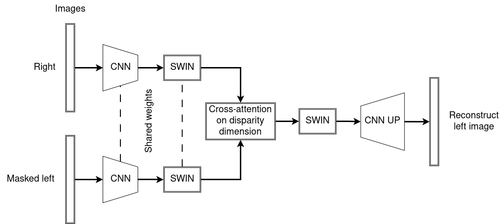
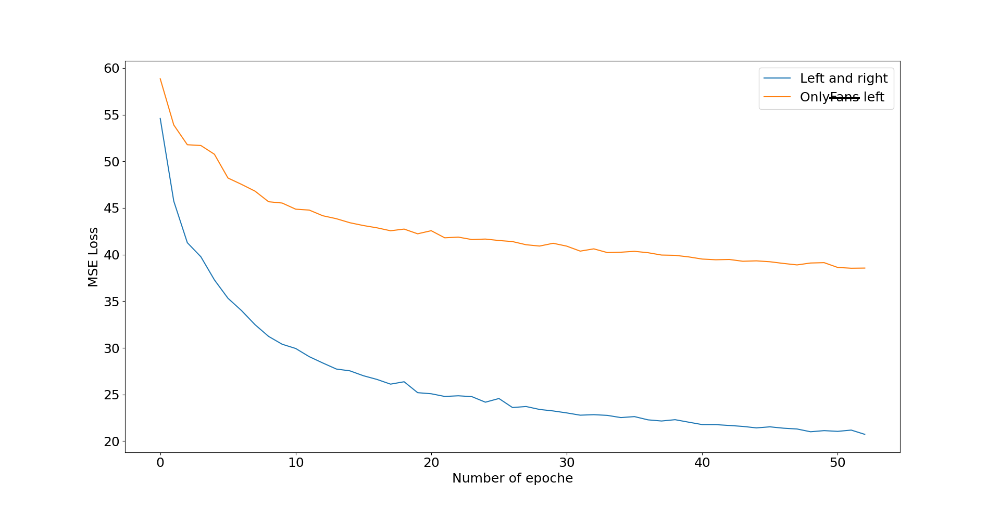
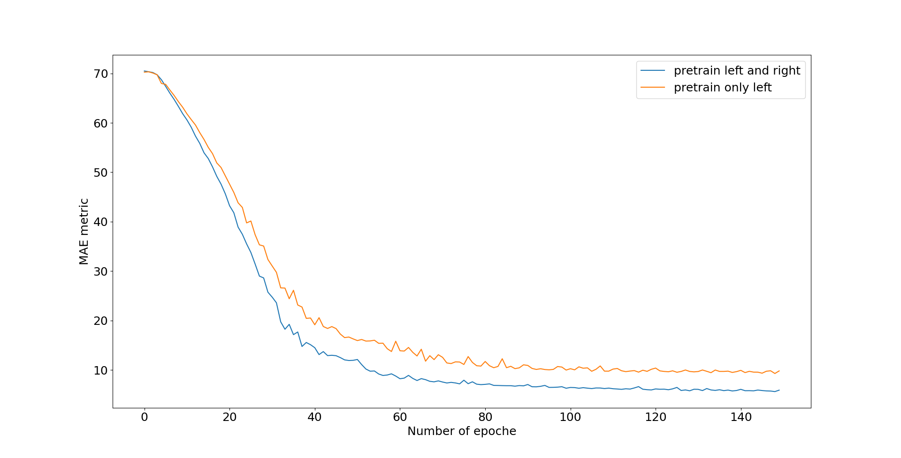
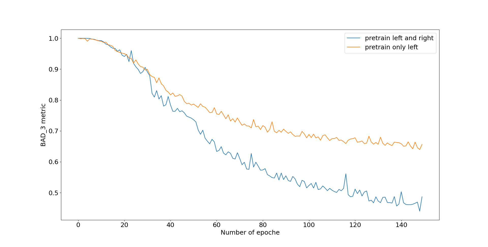
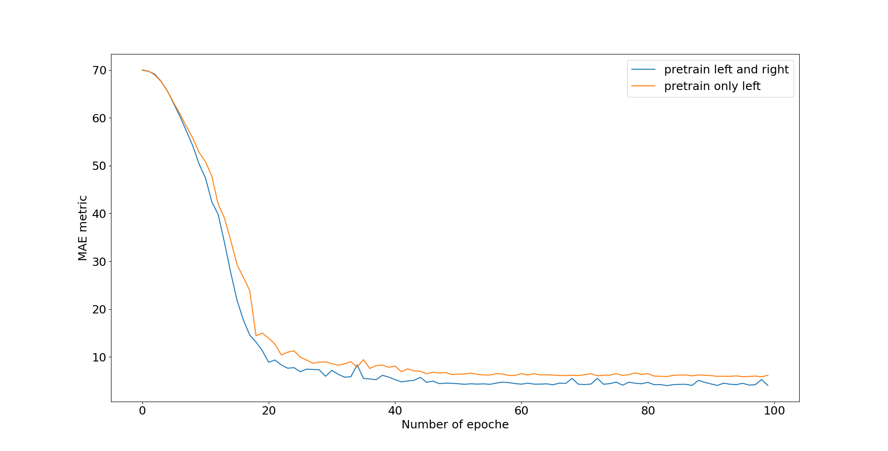
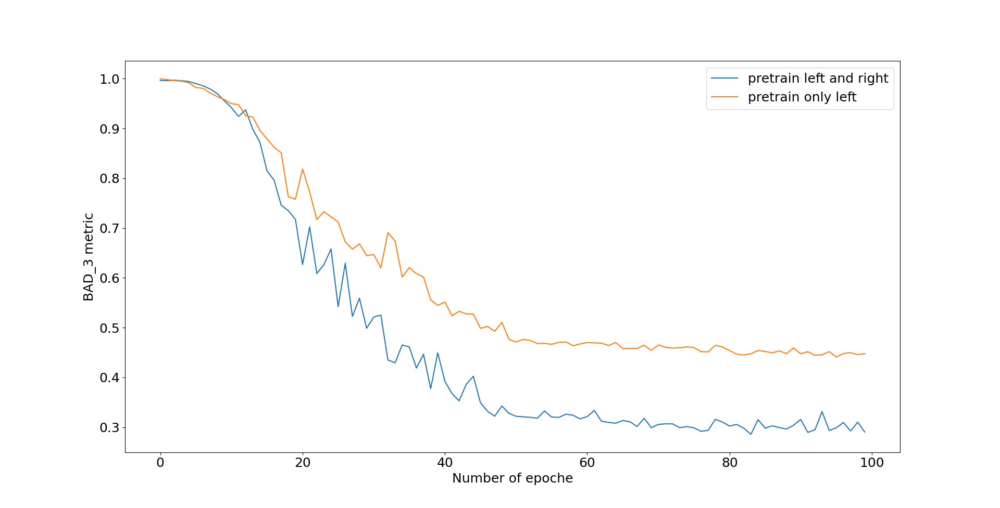
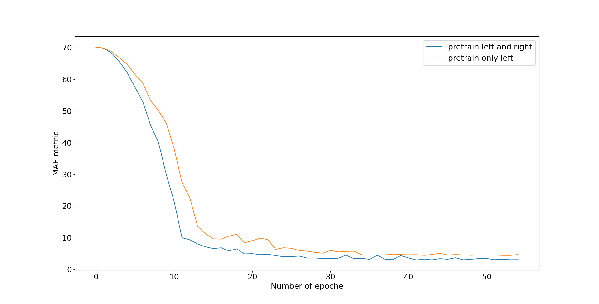
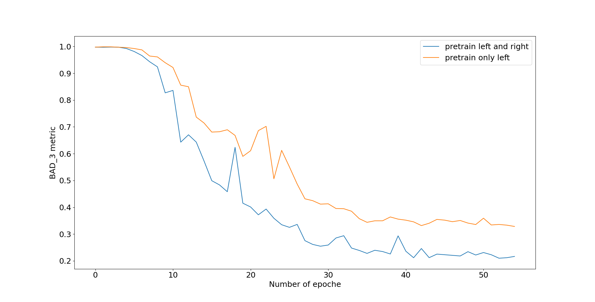

# StereoVisionPretrain
## О проекте
В данном репозитори представлена реализация модели глубокого обучения, использующая предварительное обучение без учителя, для последующего 
дообучения на таких задачах как: прогнозирование карт диспаритета для стерео пар и 3D object detection. Проект вдохновлен идеей СroСo (https://arxiv.org/abs/2210.10716, https://arxiv.org/abs/2211.10408), где предварительное обучение стерео сопоставлению основано на том, что большая часть левого изображения маскируется, и модели требуется восстановить замаскированные области по маскированному левому и правому изображениям. Для этого модель в процессе обучения должна неявно вычислять представления глубины и использовать правое изображение для более детального восстановления левого. Оригинальная работа использовала для этой задачи ViT трансформер в качестве энкодера, cross-attention по всем токенам левого и правого изображения и декодер, что является вычислительно затратным. Данный проект реализует вычислительно более легкую модель, использующую сверточные сети, swin transformer и cross-attention по размерности диспаритета (ширина, W), что позволяет ей работать в режиме реального времени (приблизительно 30 мс на rtx 4060Ti с 32 битной точностью). 
## Архитектура

Модель можно разделить на две основные части: энкодер и декодер. Энкодер состоит из сверточных слоев и блоков swin transformer. Сверточные слои понижают размеры изображения с 480х640 до 30х40, далее применяются блоки swin transformer. Декодер состоит из блока disparity cross-attention, работающего по размерности диспаритета, блоков swin transformer и сверточного блока повышения размеров изображения. 
## Результаты предварительного обучения
Основная гипотеза заключается в том, что модель в процессе предварительного обучения должна сформировать неявные представления о глубине сцены на изображении, и, используя эти представления в совокупности с представлениями немаскированного правого изображения, восстановить маскированные области левого изображения. Но необходимо проверить, действительно ли левое изображение восстанавливается с опорой на правое, или же только на основе немногочисленных немаскированных областей левого. Для проверки этого было проведено обучение модели в двух режимах: стерео и моно (only left). В стерео режиме модели на вход подается левое и правое изображение. В моно режиме только левое, а вместо представлений правого изображения на вход декодера поступает тензор с нулевыми значениями. В качестве датасета использовались реальные стерео пары, собранные мной с использованием стерео камеры. Изображения представляют собой сцены внутри жилых домов. Общее число изображений равно 17к, а где обучающая выборка занимает 0.8 частей от исходного количества, а остальное приходится на валидационную выборку. На графике ниже представлены значения функции потерь MSE на валидационной выборке для двух режимов обучения.

Из графика видно, что в стерео режиме значение функции потерь значительно ниже, что подтверждает исходную гипотезу.
## Результаты дообучения для задачи предсказания карты диспаритета
Имея предварительно обученные на неразмеченном датасете модели, проведено дообучение этих моделей для задачи предсказания карты диспаритета. Целью эксперимента является определение того, улучшает ли предварительное обучение без учителя дальнейшее обучение с учителем на размеченном наборе данных меньшего размера. Архитектура модели соответствует приведенной выше схеме, за исключением добавленного skip-connection из сверточного слоя энкодера в слой повышения разрешения декодера, для улучшения детализации карты диспаритета, хотя принципиальной роли это не играет. При дообучении на задаче предсказания карты диспаритета параметры энкодера были заморожены, а параметры блока повышения разрешения инициализированны заново. Параметры модулей disparity cross-attention и swin blocks на начальных эпохах также были заморожены, но размораживались на последующих эпохах, хотя эксперименты показали, что это не улучшает результаты, но замедляет схождение в ходе обучения. На графиках ниже приведены результаты дообучения двух моделей, одна из которых обучена в режиме left and right, а вторая в режиме only left. В качестве метрик на валидационном наборе изпользовались среднее абсолютное отклонение и BAD_3, показывающая процент пикселей карты диспаритета, чье отклонение от истинного значения превышает 3 пикселя (диспаритет оценивается в пикселях). В первом эксперименте количество стерео пар обучающей выборки было равно 1000, а валидационной 500. В качестве датасета используется unreal stereo 10k (https://github.com/edz-o/unreal-stereo-evaluation/tree/master), являющийся синтетическим. 

Из приведенных графиков видно, что предварительное обучение в стерео режиме улучшает результаты дообучения при небольшом количестве данных. На следующих графиках приведены результаты для моделей, дообученных на 2000 стерео пар, и 500 пар для валидации. 

И результаты для обучающей выборки размером 5000. 

Из всех приведенных графиков следует, что предварительное обучение улучшает дообучение на размеченных данных меньшего размера. 
## Результаты дообучения для задачи 3D object detection
Данный раздел находится в процессе редактирования...

